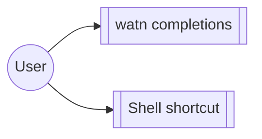

# Group: shell

## Actor

A watn user integrating watn into their shell.

## Goal

Install and use shell completions and the interactive shell shortcut so
watn behaves like a native shell citizen.

## Main flow

1. Generate and install completions (`watn completions <shell>`).
2. Use the interactive shell shortcut during sessions.

## Interactions

- generate a completion script for the caller's shell
- trigger the interactive shell shortcut (Ctrl-W) in a session

## Includes

- none

## Extends

- corpus-infra (session behaviour behind the shortcut)

## Out of scope

- Configuration content (model-setup / provider / interactive-setup).

## Diagram

