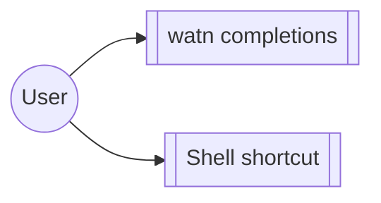

# Group: shell

## Actor

A watn user integrating watn into their shell.

## Goal

Install and use shell completions and the interactive shell shortcut so
watn behaves like a native shell citizen.

## Main flow

1. Generate and install completions (`watn completions <shell>`).
2. Use the interactive shell shortcut during sessions.

## Interactions

- Generated Bash, Zsh, and Fish configurations pass shell syntax checks
- The generated Bash widget keeps the request visible and does not evaluate the command
- Fish replaces the buffer with the generated command after Ctrl-W
- Built Bash completion generation emits the current command tree

## Includes

- none

## Extends

- corpus-infra (session behaviour behind the shortcut)

## Out of scope

- Configuration content (model-setup / provider / interactive-setup).

## Diagram

