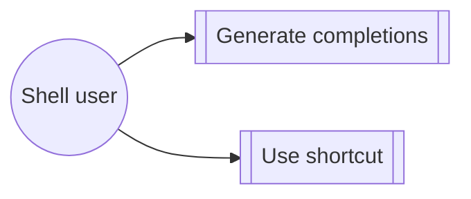

# Use case: use-shell

## Level

!

## Actors

- Shell user

## Goal

Use Watn as a native shell tool with completions and an interactive shortcut.

## Trigger

The user installs shell integrations or invokes the shortcut.

## Preconditions

- Watn is installed.

## Main flow

1. Generate shell completions.
2. Install or source the shortcut integration.
3. Use the shell interaction without evaluating an unintended command.

## Extensions

- A shell-specific syntax check rejects invalid generated configuration.

## Rules

- The shortcut preserves the request and replaces the buffer only when intended.

## Examples

- Fish replaces the buffer after Ctrl-W.

## Minimal guarantee

Shell integration never executes a command merely while generating it.

## Success guarantee

The user receives valid completions and predictable shortcut behavior.

## Personas

- none

## Capabilities

- interactive-shell-shortcut
- shell-completions

## Interactions

| Capability | Consumer action | E2E scenario |
|---|---|---|
| interactive-shell-shortcut | validate generated shell configuration | Generated Bash, Zsh, and Fish configurations pass shell syntax checks |
| interactive-shell-shortcut | inspect generated Bash widget | The generated Bash widget keeps the request visible and does not evaluate the command |
| interactive-shell-shortcut | use Fish Ctrl-W shortcut | Fish replaces the buffer with the generated command after Ctrl-W |
| shell-completions | generate Bash completions | Built Bash completion generation emits the current command tree |

## Includes

- fragment: corpus-infra

## Extends

- none

## Out of scope

Provider and model configuration.

## Diagram

